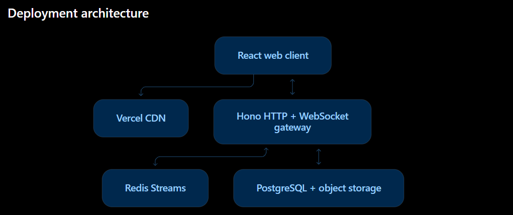

# quick-chat

## Finalised stack

| Layer                | Final choice                                |
| -------------------- | ------------------------------------------- |
| Language             | TypeScript throughout                       |
| Package management   | pnpm workspace                              |
| Frontend             | Vite + React                                |
| Styling              | Tailwind CSS                                |
| Routing              | TanStack Router                             |
| Client state         | Zustand                                     |
| Local database       | IndexedDB through Dexie                     |
| Large chat rendering | TanStack Virtual                            |
| Real-time transport  | Native WebSocket                            |
| Offline support      | Service Worker/PWA                          |
| Backend              | Node.js + Hono                              |
| WebSocket server     | `ws`                                        |
| Validation           | Zod                                         |
| Database             | PostgreSQL                                  |
| ORM/migrations       | Drizzle ORM + Drizzle Kit                   |
| Event distribution   | Redis Streams                               |
| Media storage        | S3-compatible object storage                |
| Authentication       | Secure HTTP-only cookie sessions            |
| Testing              | Vitest + Playwright                         |
| Load testing         | k6                                          |
| Monitoring           | OpenTelemetry + Sentry                      |
| Frontend hosting     | Vercel                                      |
| Backend hosting      | Docker-based, long-running Node service     |
| Initial region       | Mumbai/India, close to PostgreSQL and Redis |
| CI/CD                | GitHub Actions                              |

### Frontend deployment

Deploy client/ to Vercel as a static Vite application:

- Build command: pnpm build
- Output directory: dist
- No SSR
- No Next.js
- No server dependency for opening cached conversations
- Set `VITE_API_URL=https://<api-host>` and `VITE_WS_URL=wss://<api-host>/ws` in Vercel.
- Keep the Vercel project Root Directory set to `client`; `client/vercel.json` installs from the workspace lockfile.

### Backend deployment

Keep server/ as a long-running Node.js application:

- Hono handles REST endpoints.
- ws handles persistent WebSocket connections.
- Docker packages the server.
- REST is used for authentication, initial sync and media-upload URLs.
- WebSocket is used for message events, acknowledgements, presence and typing.
- One-to-one calls use WebRTC with authenticated WebSocket signaling and production TURN credentials.

## Local production stack

Run `docker compose up --build` to start PostgreSQL, Redis, MinIO, the migration release job, API, and background worker. The local credentials in `compose.yaml` are intentionally development-only and must never be copied to a deployed environment.

The complete production checklist, backup and rollback requirements, health probes, Vercel setup, and Mumbai topology are in [docs/deployment.md](docs/deployment.md).
